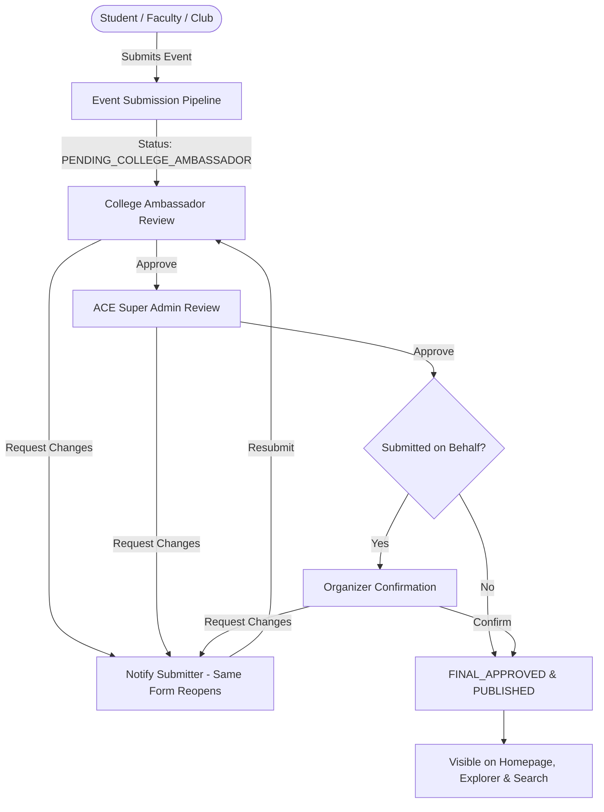

# Multi-Level Event Submission & Approval Workflow Audit

## 1. Executive Summary
AllCollegeEvent enforces a strict, multi-stage approval pipeline. **Anyone can submit an event, but only events with complete verification become publicly visible.**

---

## 2. Detailed Status Transitions

| Status | Trigger Event | Next Permitted Roles | Public Visibility |
| :--- | :--- | :--- | :--- |
| `DRAFT` | User saves draft | Submitter | ❌ Private |
| `PENDING_COLLEGE_AMBASSADOR` | User submits event | Campus Ambassador | ❌ Private |
| `CHANGES_REQUESTED_BY_AMBASSADOR` | Ambassador flags fields | Original Submitter | ❌ Private |
| `COLLEGE_AMBASSADOR_APPROVED` | Ambassador approves | ACE Super Admin | ❌ Private |
| `PENDING_ACE_ADMIN` | Forwarded to Admin | ACE Super Admin | ❌ Private |
| `CHANGES_REQUESTED_BY_ADMIN` | Admin flags fields | Original Submitter | ❌ Private |
| `ACE_ADMIN_APPROVED` | Admin approves | System / Organizer | ❌ Private |
| `PENDING_ORGANIZER_CONFIRMATION`| Sent for org confirmation | Organizer | ❌ Private |
| `CHANGES_REQUESTED_BY_ORGANIZER`| Org flags fields | Original Submitter | ❌ Private |
| `FINAL_APPROVED` | All approvals cleared | System Dispatcher | ❌ Transient |
| `PUBLISHED` | Live deployment | All Users / Search | ✅ **100% Public** |
| `REJECTED` | Reviewer rejects listing | None (Archived) | ❌ Private |

---

## 3. The "Same Form" Resubmission Rule
When changes are requested by an Ambassador, Admin, or Organizer:
1. Submitter is notified with the exact comments and flagged fields.
2. Clicking **[Update Event]** opens the **identical 8-step form** with all previously entered fields pre-populated.
3. Flagged fields are badged with `⚠ Update Required`.
4. After editing, submitter clicks **[Resubmit for Verification]** and the event returns directly to the reviewing stage without restarting the entire workflow.

---

## 4. Security & Access Control
- **Server-Side Filtering**: Only events with `status === 'PUBLISHED'` are returned by public discovery endpoints.
- **Zero Client Bypass**: No client request can update `status` to `PUBLISHED` without passing validation:
  `collegeApproval === 'APPROVED' && adminApproval === 'APPROVED' && organizerConfirmation === 'CONFIRMED'`
