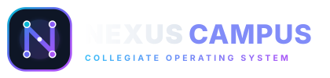

# 🎓 Nexus Campus (NEXUS)

<div align="center">
  
  
  <p align="center">
    <strong>The Global Autonomous Collegiate Opportunity & Career Operating System</strong>
  </p>

  <p align="center">
    <a href="https://github.com/DileepKumarPallapu/AI-Enhancement-Solutions-ACE-WEBSITE/actions"></a>
    <a href="https://react.dev/"></a>
    <a href="https://www.typescriptlang.org/"></a>
    <a href="https://tailwindcss.com/"></a>
    <a href="https://vitejs.dev/"></a>
    <a href="LICENSE"></a>
  </p>

  <p align="center">
    <a href="#-core-architecture">Architecture</a> •
    <a href="#-13-canonical-workspaces">Workspaces</a> •
    <a href="#-getting-started">Quickstart</a> •
    <a href="#-test-suites--verification">Verification</a> •
    <a href="#-live-hackathon-demo-mode">Demo Mode</a>
  </p>
</div>

---

## 🌟 Executive Summary

**Nexus Campus (NEXUS)** is an AI-native collegiate operating system engineered to unite students, faculty mentors, department heads, campus ambassadors, hackathon organizers, recruiters, competition judges, placement directors, training providers, and institutional leaders into **ONE unified platform**.

### Core Value Pillars:
- **Autonomous Opportunity Exchange**: Multi-tier verified hackathons, research symposiums, fellowships, and grants.
- **Dynamic Skill Graph & Career Simulator**: Real-time competencies mapped to industry benchmarks with automated code evidence proof.
- **Universal Multi-Workspace OS**: 13 canonical role workspaces accessible via a single login and persistent state synchronization.
- **Autonomous Workflow Engine**: Multi-step state machine with dry-run simulations, role approval gates, tasks, and idempotency guarantees.
- **Cryptographic Credential Authority**: Tamper-proof digital student passports, QR attendance verification, and SHA-256 certificate validation.

---

## 🏛 Institutional Anchor

> **Anchor Institution**: Vel Tech Rangarajan Dr. Sagunthala R&D Institute of Science and Technology  
> **Department**: Department of Computer Science & Engineering (Avadi, Chennai, Tamil Nadu)  
> **Canonical ID**: `inst-vel-tech-rangarajan-avadi`

---

## 💼 13 Canonical Workspaces

Nexus Campus provides dedicated, verified workspaces tailored for each key stakeholder:

| # | Workspace Role | Canonical Route | Key Responsibilities & Capabilities |
|---|---|---|---|
| 1 | **Student OS** | `/student/dashboard` | Personalized opportunity discovery, interactive skill graph, wallet rewards, student lab, and digital passport. |
| 2 | **Campus Ambassador** | `/ambassador/dashboard` | Event proposal sign-offs, student referral trees, and departmental outreach campaigns. |
| 3 | **Faculty Mentor** | `/mentor/dashboard` | 1-on-1 sprint reviews, student project lab milestone endorsements, and research paper reviews. |
| 4 | **Industry Mentor** | `/mentor/dashboard` | Technical mock interviews, career guidance roadmaps, and mentee dossier management. |
| 5 | **Event Organizer** | `/organizer/dashboard` | Multi-track hackathon command, QR attendance scanner, prize pool management, and verifiable certificate issuance. |
| 6 | **College Directorate** | `/college/dashboard` | Institutional hierarchy, faculty allocations, and NBA/NAAC accreditation evidence tracking. |
| 7 | **Recruiter Hub** | `/recruiter/dashboard` | Proven code-evidence talent radar, 1-click interview scheduling, and job offer pipeline. |
| 8 | **Judge Portal** | `/judge/dashboard` | Blind code evaluation, multi-criteria weighted rubrics, and real-time leaderboard commits. |
| 9 | **Placement Cell OS** | `/placement` | Corporate drive coordination, automated student eligibility validator, and CTC analytics. |
| 10 | **Club & Chapter** | `/college/clubs` | Student chapter memberships, internal hack nights, equipment tracking, and club event engine. |
| 11 | **Training Provider** | `/provider` | Micro-course publishing, cohort progress tracking, and credential dispatch. |
| 12 | **Partner Network** | `/partners` | Global sponsorship campaigns, research lab grants, and opportunity exchange. |
| 13 | **Superadmin Hub** | `/admin/dashboard` | Platform governance, AI token usage cost center, and workflow failure queues. |

---

## 🛠 Tech Stack

- **Core Framework**: React 19, TypeScript 5.7, Vite 6.1
- **Styling & Design Tokens**: Tailwind CSS 3.4, Custom CSS Variables, Lucide React Icons
- **Animation & FX**: Canvas Confetti, Tailwind Glassmorphism & Keyframe Shimmers
- **Router**: React Router DOM 7.2 (Data Router Architecture)
- **Data Persistence**: LocalStorage multi-tenant engine with offline fallback & cross-tab pub/sub event sync

---

## 🚀 Getting Started

### Prerequisites
- Node.js `>= 18.0.0`
- npm `>= 9.0.0`

### Installation & Local Run

```bash
# 1. Clone the repository
git clone https://github.com/DileepKumarPallapu/AI-Enhancement-Solutions-ACE-WEBSITE.git
cd AI-Enhancement-Solutions-ACE-WEBSITE

# 2. Install dependencies
npm install

# 3. Start development server on port 8080
npm run dev -- --port 8080 --host
```

Open [http://localhost:8080](http://localhost:8080) in your browser.

---

## 🧪 Test Suites & Verification

Nexus Campus comes with comprehensive test suites verifying domain events, permissions, cryptographic credentials, workflows, and persistence:

```bash
# Run all 184 test assertions across all test suites
npm test

# Run TypeScript typechecks
npx tsc --noEmit

# Build production bundle
npm run build
```

---

## 🎪 Live Hackathon Demo Mode

For evaluation and demonstration purposes, Nexus Campus provides an isolated **Hackathon Demo Mode**:
- **Presentation Tour**: Navigate to [`/demo`](http://localhost:8080/demo) to launch the guided 15-step interactive tour.
- **Universal Switcher**: Switch freely between all 13 dashboards at [`/workspaces`](http://localhost:8080/workspaces).
- **Zero Configuration**: Pre-seeded with authentic collegiate records for Vel Tech student lead Dileep Kumar Pallapu.

---

## 📄 License

Distributed under the **MIT License**. See `LICENSE` for more information.

---

<div align="center">
  <sub>Built with ❤️ for Students, Colleges, and Innovators worldwide by the Nexus Campus Engineering Team.</sub>
</div>
